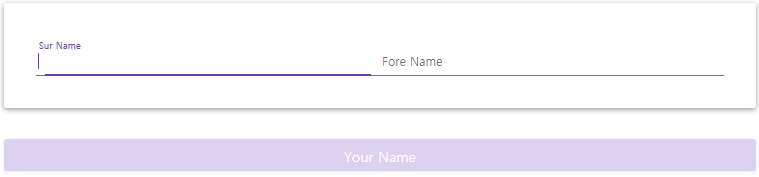
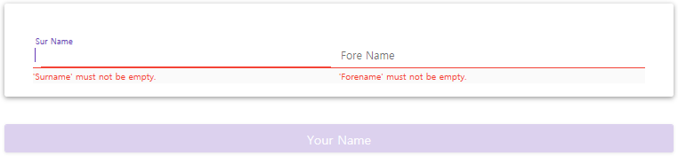

# [ReactiveValidationObject](https://github.com/jybbang/ReactiveValidationObject.git)

It is a small library for [ReactiveUI](https://reactiveui.net/) to support XAML Binding validation using [*FluentValidation](https://fluentvalidation.net/)

- ReactiveUI is one of the most powerful framworks for MVVM.
- It has a original validation library ([ReactiveUI.Validation](https://reactiveui.net/docs/handbook/user-input-validation/)), It is very simple to use and well functioned.
- But It does not support `INotifyDataErrorInfo` interface for XAML binding engine to display validation erros in your view.
- So, I wrap the base ViewModel (ReactiveObject) with a popular validation library [*FluentValidation](https://fluentvalidation.net/)
- To XAML binding, we should initialize the DataContext of View. Andthen we use some traditional XAML markup bindings (only some properties that we want to validate).

> CAUTION 
>
> If you HATE to use XAML markup bindings. It's NOT for you.

## Get Started

### 1. Installation

ReactiveValidationObject can be installed using the Nuget package manager or the dotnet CLI:

    Install-Package ReactiveUI-FluentValidation

Or you can just copy the `ReactiveValidationObject.cs` into your project.

After that you should get [*FluentValidation](https://fluentvalidation.net/) pakage.

### 2. Use case

I use a popular validation library *FluentValidation. Therefore you can learn more validation rules HERE - [https://fluentvalidation.net/](https://fluentvalidation.net/)

So this thime. I just show a how to use my library only.

This is our first ReactiveObject ViewModel class:
```csharp
    using ReactiveUI;
    
    public class AppViewModel : ReactiveObject
    {
      private string fullname;
      private string surname;
      private string forename;
      public string Fullname
      {
        get => fullname;
        set
        {
          this.RaiseAndSetIfChanged(ref fullname, value);
        }
      }
      public string Surname
      {
        get => surname;
        set
        {
          this.RaiseAndSetIfChanged(ref surname, value);
        }
      }
      public string Forename
      {
        get => forename;
        set
        {
          this.RaiseAndSetIfChanged(ref forename, value);
        }
      }
    
      public ReactiveCommand<Unit, Unit> SomeAction { get; }
    
      public AppViewModel()
      {
        var isValid = this.WhenAnyValue(vm => vm.Surname, vm => vm.Forename)
          .Select(x => !String.IsNullOrWhiteSpace(x.Item1) 
    			&& !String.IsNullOrWhiteSpace(x.Item2));
    
        SomeAction = ReactiveCommand.Create(() =>
        {
          Fullname = $"{Forename} {Surname}";
        }, isValid);
      }
    }
```
As you can see it is work very well.

You can not click the button if suname and forename are empty:



However If you wanna display validation erros in your view.

Follow next step.

### 3. Create your validator

You would define a set of validation rules for our first class by inheriting from `AbstractValidator<T>` :
```csharp
    using FluentValidation;
    
    public class AppViewModelValidator : AbstractValidator<AppViewModel>
    {
      public AppViewModelValidator()
      {
        RuleFor(vm => vm.Surname).NotEmpty();
        RuleFor(vm => vm.Forename).NotEmpty();
      }
    }
```
### 4. Define your ReactiveValidationObject class

First of all we should change base class.

Before: 
```csharp
    public class AppViewModel : ReactiveObject
```
After:
```csharp
    using ReactiveUI.FluentValidation;
    public class AppViewModel : ReactiveValidationObject
```
And then you have to set an argument `AbstractValidator<AppViewModel>`  to the base class constructor:
```csharp
    public AppViewModel() : base(new AppViewModelValidator())
    {
      SomeAction = ReactiveCommand.Create(() =>
      {
          Fullname = $"{Forename} {Surname}";
      }, isValid);
    }
```
You now don't need define `IObservable<bool> isValid`  any more. The validation result `isValid` will be set if validations are completed.

Finally, You should raise an event related property `this.RaiseValidation(nameof(Property))`:
```csharp
    public string Surname
    {
      get => surname;
      set
      {
          this.RaiseAndSetIfChanged(ref surname, value);
          this.RaiseValidation(nameof(Surname));
      }
    }
    public string Forename
    {
      get => forename;
      set
      {
          this.RaiseAndSetIfChanged(ref forename, value);
          this.RaiseValidation(nameof(Forename));
      }
    }
```
So, This is our first ReactiveValidationObject ViewModel class:
```csharp
    using ReactiveUI;
    using ReactiveUI.FluentValidation;
    using FluentValidation;
    
    public class AppViewModelValidator : AbstractValidator<AppViewModel>
    {
      public AppViewModelValidator()
      {
        RuleFor(vm => vm.Surname).NotEmpty();
        RuleFor(vm => vm.Forename).NotEmpty();
      }
    }
    
    public class AppViewModel : ReactiveValidationObject
    {
    	private string fullname;
    	private string surname;
    	private string forename;
    	
    	public string Fullname
    	{
    	    get => fullname;
    	    set
    	    {
    	        this.RaiseAndSetIfChanged(ref fullname, value);
    	    }
    	}
    	public string Surname
    	{
    	    get => surname;
    	    set
    	    {
    	        this.RaiseAndSetIfChanged(ref surname, value);
    	        this.RaiseValidation(nameof(Surname));
    	    }
    	}
    	public string Forename
    	{
    	    get => forename;
    	    set
    	    {
    	        this.RaiseAndSetIfChanged(ref forename, value);
    	        this.RaiseValidation(nameof(Forename));
    	    }
    	}
    	
    	public ReactiveCommand<Unit, Unit> SomeAction { get; }
    	
    	public AppViewModel() : base(new AppViewModelValidator())
    	{
    	    SomeAction = ReactiveCommand.Create(() =>
    	    {
    	        Fullname = $"{Forename} {Surname}";
    	    }, isValid);
    	}
    }
```
### 5. Modify your View

As I mentioned our goal is to display errors in your view. To use XAML binding engine set DataContext:
```csharp
    DataContext = ViewModel;
```
And then you should bind properties in xaml:
```xml
    <TextBox x:Name="TextboxSurname"         
             Text="{Binding Surname, Mode=TwoWay, UpdateSourceTrigger=PropertyChanged}" />
    
    <TextBox x:Name="TextboxForename"         
             Text="{Binding Forename, Mode=TwoWay, UpdateSourceTrigger=PropertyChanged}" />
```
Now you can see errors in your view like this:


